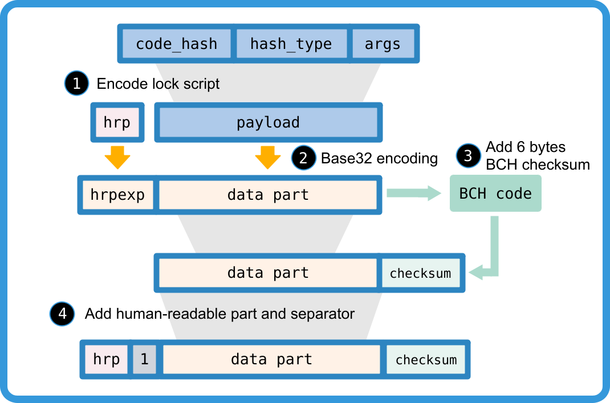

# Address Format

## Abstract

CKB Address Format is an application level [lock script][script-define] display recommendation. The lock script consists of three key parameters, including version, args, and binary_hash. In the consideration of user experience, it is necessary to wrap the raw data structure into a verifiable and extensible format.

## Solution

CKB Address Format follows [Bitcoin base32 address format (BIP-173)][bip173] rules, which add a version prefix to the payload, and wrap them in **Bech32** encoding and a [BCH checksum][bch].

A Bech32 string is at most 90 characters long and consists of the **human-readable part**, the **separator**, and the **data part**. The last 6 characters of data part is checksum. The data part is base32 encoded. Here is the readable translation of base32 encoding table.

|0|1|2|3|4|5|6|7|
|-|-|-|-|-|-|-|-|
|**+0**|q|p|z|r|y|9|x|8|
|**+8**|g|f|2|t|v|d|w|0|
|**+16**|s|3|j|n|5|4|k|h|
|**+24**|c|e|6|m|u|a|7|l|


The human-readable part is "ckb" for CKB mainnet, and "ckt" for the testnet. The separator is always "1".



## Payload

The first step to encode lock script into address is to encode it to payload. We use type field in payload to identify different encoding methods according to different user scenario needs, and parameter fields to represent lock script data.

```
payload = type | parameter1 | parameter2 | ...
```

|   type     |    parameter1    | parameter2  | lock script |
|------------|------------------|-------------|-------------|
|    0x00    | bin-idx (Byte[4])|  PK/PKHash  | {version:0, binary_hash: libs[p1], args:[p2]} |
|    0x01    | bin-hash (H256)  |  PK/PKHash  | {version:0, binary_hash: p1, args:[p2]} |

Type 0 is a compact address format which identifies common used binary hash by 4 bytes instead of 32 bytes. Type 1 is a standard address format consists of full binary hash infomation. Other type number address formats are reserved.

Note that current payload types only support 1 parameter in args field. However, it is easy to be extended to support multiple parameters.

### bin-idx

Binary field in payload part means script binary reference, it could be in either bin-idx type or bin-hash type. Bin-hash is the simple H256 format hash of binary data. Bin-idx is a simplified binary hash index, which stored in application level. Different bin-idx means different binary_hash in shorter length.

|     bin-idx    | binary_hash link    | args |
|----------------|---------------------|------|
|      SP2K      | SECP256K1 algorithm |  PK  |
|      SP2R      | SECP256R1 algorithm |  PK  |
|      P2PH      | SECP256K1 + blake160 | blake160(pk)  |
|      P2PK      | Alias of SP2K       |  PK  |

The blake160 here means the first 20 bytes truncation of Blake2b hash function.

## Examples

### Encode lock script to address

The original lock script is,

```js
{
    version: 0,
    args: ['13e41d6F9292555916f17B4882a5477C01270142'],
    binary_hash: 0x48a2ce278d84e1102b67d01ac8a23b31a81cc54e922e3db3ec94d2ec4356c67c
}
```

Suppose that the binary_hash is from secp256k1 with blake160 algorithm implementation binary. And the sole parameter of args is secp256k1 public key's blake160 result. We could simply encode the lock script into P2PH address format.

Firstly, compact lock script to payload.

```c
payload = 0x00 | "P2PH" | 0x13e41d6F9292555916f17B4882a5477C01270142
```

Calculate the base32 format of hrp and payload.

```c
Base32(hrp) = "rrrqrtz"
Base32(payload) = "qpgry5zgz0jp6mujjf24j9h30dyg9f280sqjwq2z"
```

Calculate checksum

```c
checksum = BCH_checksum(Base32(hrp) | Base32(payload)) = fudqzw
```

Add up together

```c
address = hrp | 1 | Base32(payload) | checksum 
        = "ckb1qpgry5zgz0jp6mujjf24j9h30dyg9f280sqjwq2zfudqzw"
```


[script-define]:https://github.com/nervosnetwork/ckb/blob/develop/core/src/script.rs#L17

[bip173]: https://github.com/bitcoin/bips/blob/master/bip-0173.mediawiki

[bch]: https://en.wikipedia.org/wiki/BCH_code