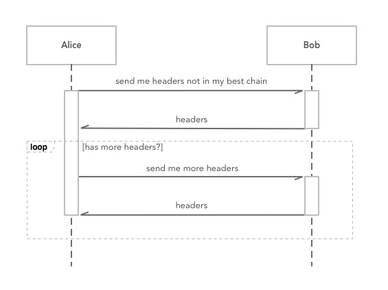
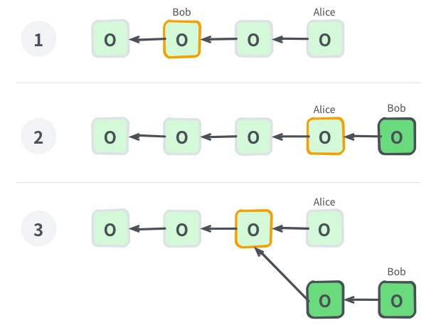
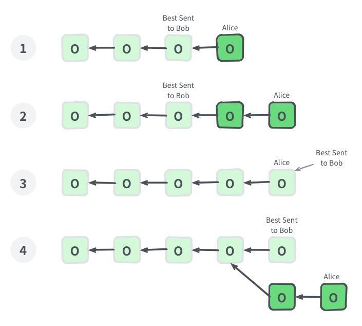

# 链同步协议

术语说明

- Chain: 创世块开头，由连续的块组成的链。
- Best Chain: 节点之间要达成最终一致的、满足共识验证条件的、PoW 累积工作量最高的、以共识的创世块开始的 Chain。
- Best Header Chain: 累积工作量最高，由状态是 Connected, Downloaded 或者 Accepted 的块组成的 Chain。详见下面块状态的说明。
- Tip: Chain 最后一个块。Tip 可以唯一确定 Chain。
- Best Chain Tip: Best Chain 的最后一个块。

## 同步概览

块同步**必须**分阶段进行，采用 [Bitcoin Headers First](https://bitcoin.org/en/glossary/headers-first-sync) 的方式。每一阶段获得一部分块的信息，或者基于已有的块信息进行验证，或者两者同时进行。

1.  连接块头 (Connect Header): 获得块头，验证块头格式正确且 PoW 工作量有效
2.  下载块 (Download Block): 获得块内容，验证完整的块，但是不依赖祖先块中的交易信息。
3.  采用块 (Accept Block): 在链上下文中验证块，会使用到祖先块中的交易信息。

分阶段执行的主要目的是先用比较小的代价排除最大作恶的可能性。举例来说，第一步连接块头的步骤在整个同步中的工作量可能只有 5%，但是完成后能有 95% 的可信度认为块头对应的块是有效的。

按照已经执行的阶段，块可以处于以下 5 种状态：

1.  Unknown: 在连接块头执行之前，块的状态是未知的。
2.  Invalid：任意一步失败，块的状态是无效的，且当一个块标记为 Invalid，它的所有子孙节点也都标记为 Invalid。
3.  Connected: 连接块头成功，且该块到创世块的所有祖先块都必须是 Connected, Downloaded 或 Accepted 的状态。
4.  Downloaded: 下载块成功，且该块到创世块的所有祖先块都必须是 Downloaded 或者 Accepted 的状态。
5.  Accepted: 采用块成功，且该块到创世块的所有祖先块都必须是 Accepted 的状态。

块的状态是会沿着依赖传递的。按照上面的编号，子块的状态编号一定不会大于父块的状态编号。首先，如果某个块是无效的，那依赖它的子孙块自然也是无效的。另外，同步的每一步代价都远远高于前一步，且每一步都可能失败。如果子节点先于父节点进入下一阶段，而父节点被验证为无效，那子节点上的工作量就浪费了。而且，子块验证是要依赖父块的信息的。

初始时创世块状态为 Accepted，其它所有块为 Unknown。

之后会使用以下图示表示不同状态的块：

参与同步的节点创世块**必须**相同，所有的块必然是组成由创世块为根的一颗树。如果块无法最终连接到创世块，这些块都可以丢弃不做处理。

参与节点都会在本地构造这颗状态树，其中全部由 Accepted 块组成的累积工作量最大的链就是 Best Chain。而由状态可以是 Connected, Downloaded 或 Accepted 块组成的累积工作量最大的链就是 Best Header Chain.

下图是节点 Alice 构造的状态树的示例，其中标记为 Alice 的块是该节点当前的 Best Chain Tip。

## 连接块头

先同步 Headers 可以用最小的代价验证 PoW 有效。构造 PoW 时，不管放入无效的交易还是放入有效的交易都需要付出相同的代价，那么攻击者会选择其它更高性价比的方式进行攻击。可见，当 PoW 有效时整个块都是有效的概率非常高。所以先同步 Headers 能避免浪费资源去下载和验证无效块。

因为代价小，同步 Headers 可以和所有的节点同时进行，在本地能构建出可信度非常高的、当前网络中所有分叉的全局图。这样可以对块下载进行规划，避免浪费资源在工作量低的分支上。

连接块头这一步的目标是，当节点 Alice 连接到节点 Bob 之后，Alice 让 Bob 发送所有在 Bob 的 Best Chain 上但不在 Alice 的 **Best Header Chain** 上的块头，进行验证并确定这些块的状态是 Connected 还是 Invalid。

Alice 在连接块头时，需要保持 Best Header Chain Tip 的更新，这样能减少收到已有块头的数量。

上图是一轮连接块头的流程。完成了一轮连接块头后，节点之间应该通过新块通知保持之后的同步。

以上图 Alice 从 Bob 同步为例，首先 Alice 将自己 Best Header Chain 中的块进行采样，将选中块的哈希作为消息内容发给 Bob。采样的基本原则是最近的块采样越密，越早的块越稀疏。比如可以取最后的 10 个块，然后从倒数第十个块开始按 2, 4, 8, … 等以 2 的指数增长的步长进行取样。采样得到的块的哈希列表被称为 Locator。下图中淡色处理的是没有被采样的块，创世块应该始终包含在 Locator 当中。

Bob 根据 Locator 和自己的 Best Chain 可以找出两条链的最后一个共同块。因为创世块相同，所以一定存在这样一个块。Bob 把共同块之后一个开始到 Best Chain Tip 为止的所有块头发给 Alice。

上图中未淡出的块是 Bob 要发送给 Alice 的块头，金色高亮边框的是最后共同块。下面列举了同步会碰到的三种情况：

1.  Bob 的 Best Chain Tip 在 Alice 的 Best Header Chain 中，最后共同块就是 Bob 的 Best Chain Tip，Bob 没有块头可以发送。
2.  Alice 的 Best Header Chain Tip 在 Bob 的 Best Chain 中并且不等于 Tip，最后共同块就是 Alice 的 Best Header Chain Tip。
3.  Alice 的 Best Header Chain 和 Bob 的 Best Chain 出现了分叉，最后共同块是发生发叉前的块。

如果要发送的块很多，需要做分页处理。Bob 先发送第一页，Alice 通过返回结果发现还有更多的块头就继续向 Bob 请求接下来的页。一个简单的分页方案是限制每次返回块头的最大数量，比如 2000。如果返回块头数量等于 2000，说明可能还有块可以返回，就接着请求之后的块头。如果某页最后一个块是 Best Header Chain Tip 或者 Best Chain Tip 的祖先，可以优化成用对应的 Tip 生成 Locator 发送请求，减少收到已有块头的数量。

在同步的同时，Alice 可以观察到 Bob 当前的 Best Chain Tip，即在每轮同步时最后收到的块。如果 Alice 的 Best Header Chain Tip 就是 Bob 的 Best Chain Tip ，因为 Bob 没有块头可发，Alice 就无法观测到 Bob 目前的 Best Chain。所以在每轮连接块头同步的第一个请求时，**应该**从 Best Header Chain Tip 的父块开始构建，而不包含 Tip。

在下面的情况下**必须**做新一轮的连接块头同步。

- 收到对方的新块通知，但是新块的父块状态时 Unknown

连接块头时可能会出现以下一些异常情况：

- Alice 观察到的 Bob Best Chain Tip 很长一段时间没有更新，或者时间很老。这种情况 Bob 无法提供有价值的数据，当连接数达到限制时，可以优先断开该节点的连接。
- Alice 观察到的 Bob Best Chain Tip 状态是 Invalid。这个判断不需要等到一轮 Connect Head 结束，任何一个分页发现有 Invalid 的块就可以停止接受剩下的分页了。因为 Bob 在一个无效的分支上，Alice 可以停止和 Bob 的同步，并将 Bob 加入到黑名单中。
- Alice 收到块头全部都在自己的 Best Header Chain 上，这有两种可能，一是 Bob 故意发送，二是 Alice 在 Connect Head 时 Best Chain 发生了变化，由于无法区分只能忽略，但是可以统计发送的块已经在本地 Best Header Chain 上的比例，高于一定阈值可以将对方加入到黑名单中。

在收到块头消息时可以先做以下格式验证：

- 消息中的块是连续的
- 所有块和第一个块的父块在本地状态树中的状态不是 Invalid
- 第一个块的父块在本地状态树中的状态不是 Unknown，即同步时不处理 Orphan Block。

这一步的验证包括检查块头是否满足共识规则，PoW 是否有效。因为不处理 Orphan Block，难度调整也可以在这里进行验证。

上图是 Alice 和 Bob, Charlie, Davis, Elsa 等节点同步后的状态树情况和观测到的其它节点的 Best Chain Tip。

如果认为 Unknown 状态块是不在状态树上的话，在连接块头阶段，会在状态树的末端新增一些 Connected 或者 Invalid 状态的节点。所以可以把连接块头看作是拓展状态树，是探路的阶段。

## 下载块

完成连接块头后，一些观测到的邻居节点的 Best Chain Tip 在状态树上的分支是以一个或者多个 Connected 块结尾的，即 Connected Chain，这时可以进入下载块流程，向邻居节点请求完整的块，并进行必要的验证。

因为有了状态树，可以对同步进行规划，避免做无用工作。一个有效的优化就是只有当观测到的邻居节点的 Best Chain 的累积工作量大于本地的 Best Chain 的累积工作量才进行下载块。而且可以按照 Connected Chain 累积工作量为优先级排序，优先下载累积工作量更高的分支，只有被验证为 Invalid 或者因为下载超时无法进行时才去下载优先级较低的分支。

下载某个分支时，因为块的依赖性，应该优先下载更早的块；同时应该从不同的节点去并发下载，充分利用带宽。这可以使用滑动窗口解决。

假设分支第一个要下载的 Connected 状态块号是 M，滑动窗口长度是 N，那么只去下载 M 到 M + N - 1 这 N 个块。在块 M 下载并验证后，窗口往右移动到下一个 Connected 状态的块。如果块 M 验证失败，则分支剩余的块也就都是 Invalid 状态，不需要继续下载。如果窗口长时间没有向右移动，则可以判定为下载超时，可以在尝试其它分支之后再进行尝试，或者该分支上有新增的 Connected 块时再尝试。

上图是一个长度为 8 的滑动窗口的例子。开始时可下载的块是从 3 到 10。块 3 下载后，因为 4 已经先下载好了，所以窗口直接滑动到从 5 开始。

因为通过连接块头已经观测到了邻居节点的 Best Chain，如果在对方 Best Chain 中且对方是一个全节点，可以认为对方是能够提供块的下载的。在下载的时候可以把滑动窗口中的块分成小块的任务加到任务队列中，在能提供下载的节点之间进行任务调度。

下载块如果出现交易对不上 Merkle Hash Root 的情况，或者能对上但是有重复的交易 txid 的情况，并不能说明块是无效，只是没有下载到正确的块内容。可以将对方加入黑名单，但是不能标记块的状态为 Invalid，否则恶意节点可以通过发送错误的块内容来污染节点的状态树。

这一阶段需要验证交易列表和块头匹配，但是不需要做任何依赖祖先块中交易内容的验证，这些验证会放在下一阶段进行。

可以进行的验证比如 Merkel Hash 验证、交易 txid 不能重复、交易列表不能为空、所有交易不能 inputs outputs 同时为空、只有第一个交易可以是 generation transaction 等等。

下载块会把状态树中工作量更高的 Connected Chain 中的 Connected 块变成 Downloaded 或者 Invalid。

## 采用块

在上一阶段中会产生一些以一个或多个 Downloaded 状态的块结尾的链，以下简称为 Downloaded Chain。如果这些链的累积工作量大于 Best Chain Tip， 就可以对这条链进行该阶段完整的合法性验证。如果有多个这样的链，选取累积工作量最高的。

这一阶段需要完成所有剩余的验证，包括所有依赖于历史交易内容的规则。

因为涉及到 UTXO (未消耗掉的交易 outputs) 的索引，这一步的验证开销是非常大的。为了简化系统，可以只保留一套 UTXO 索引，尝试将本地的 Best Chain Tip 进行必要回退，然后将 Downloaded Chain 上的块进行一次验证，再添加到 Best Chain 上。如果中间有块验证失败则 Downloaded Chain 上剩余的块也就都是 Invalid 状态不需要再继续。这时 Best Chain Tip 甚至会低于之前的 Tip，如果遇到可以采取以下的方案处理：

- 如果回退之前的 Best Chain 工作量比当前 Tip 更高，恢复之前的 Best Chain
- 如果有其它 Downloaded Chain 比回退之前的 Best Chain 工作量更高，可以继续使用下一个 Downloaded Chain 进行采用块的步骤。

采用块会将工作量更高的 Downloaded Chain 中的 Downloaded 状态块变成 Accepted 或者 Invalid，而累积工作量最高的 Downloaded Chain 应该成为本地的 Best Chain。

## 新块通知

当节点的 Best Chain Tip 发生变化时，应该通过推送的方式主动去通知邻居节点。为了避免通知重复的块，和尽量一次性发送邻居节点没有的块，可以记录给对方发送过的累积工作量最高的块头 (Best Sent Header)。发送过不但指发送过新块通知，也包括发送过在连接块头时给对方的块头的回复。

因为可以认为对方节点已经知道 Best Sent Header，及其祖先节点，所以发送新块通知时可以排除掉这些块。

上面的例子中标记为 Alice 的块是节点 Alice 的 Best Chain Tip。标记为 Best Sent to Bob 是记录的发送给 Bob 工作量最高的块头。其中未淡化的块是 Alice 需要通知给 Bob 的新块。数字对应的每一步说明如下：

1. 开始时 Alice 只有 Best Chain Tip 需要发送
2. Alice 还没有来得及发送，就又多了一个新块，这时需要发送 Best Chain 最后两个块头
3. Alice 将最后两个块头发送给了 Bob 并同时更新了 Best Sent to Bob
4. Alice 的 Best Chain 发生了分支切换，只需要发送和 Best Sent to Bob 最后共同块之后的块。

基于连接的协商参数和要通知的新块数量：

- 数量为 1 且对方偏好使用 Compact Block [^1]，则使用 Compact Block
- 其它情况直接发送块头列表，但要限制发送块的数量不超过某个阈值，比如 8，如果有 8 个或更多的块要通知，只通知最新的 7 个块。

当收到新块通知时，会出现父块状态是 Unknown 的情况，即 Orphan Block，这个时候需要立即做一轮连接块头的同步。收到 Compact Block 且父块就是本地的 Best Chain Tip 的时候可以尝试用交易池直接恢复，如果恢复成功，直接可以将三阶段的工作合并进行，否则就当作收到的只是块头。

## 同步状态

### 配置

- `GENESIS_HASH`: 创世块哈希
- `MAX_HEADERS_RESULTS`: 一条消息里可以发送块头的最大数量
- `MAX_BLOCKS_TO_ANNOUNCE`: 新块通知数量不可超过该阈值
- `BLOCK_DOWNLOAD_WINDOW`: 下载滑动窗口大小

### 存储

- 块状态树
- Best Chain Tip，决定是否要下载块和采用块。
- Best Header Chain Tip，连接块头时用来构建每轮第一个请求的 Locator

每个连接节点需要单独存储的

- 观测到的对方的 Best Chain Tip
- 上一次发送过的工作量最高的块头哈希 Best Sent Header

## 消息定义

具体消息定义见参考实现，这里只列出同步涉及到的消息和必要的一些字段和描述。

消息的发送是完全异步的，比如发送 `getheaders` 并不需要等待对方回复 `headers` 再发送其它请求，也不需要保证请求和回复的顺序关系，比如节点 A 发送了 `getheaders` 和 `getdata` 给 B，B 可以先发送 `block`，然后再发送 `headers` 给 A。

Compact Block [^1] 需要使用到的消息 `cmpctblock` 和 `getblocktxn` 会在 Compact Block 相关文档中说明。

### getheaders

用于连接块头时向邻居节点请求块头。请求第一页，和收到后续页使用相同的 getheaders 消息，区别是第一页是给本地的 Best Header Chain Tip 的父块生成 Locator，而后续页是使用上一页的最后一个块生成 Locator。

- `locator`: 对 Chain 上块采样，得到的哈希列表

### headers

用于回复 `getheaders` 和通知新块，处理逻辑没有区别，只是当块头数量小于 `MAX_BLOCKS_TO_ANNOUNCE` 时如果发现有 Orphan Block，因为可能是新块通知，所以需要做一次连接块同步。收到 `headers` 如果块头数量等于 `MAX_HEADERS_RESULTS` 表示还有更多的块需要请求。

- `headers`：块头列表

### getdata

用于下载块阶段

- `inventory`: 要下载对象列表，每个成员包含字段
	- `type`: 下载对象的类型，这里只用到块
	- `hash`: 使用对象哈希做标识符

### block

回复 `getdata` 的块下载请求

- `header` 块头
- `transactions` 交易列表

[^1]:	Compact Block 是种压缩传输完整块的技术。它基于在传播新块时，其中的交易应该都已经在对方节点的交易池中。这时只需要包含 交易 txid 列表，和预测对方可能没有的交易的完整信息，接收方就能基于交易池恢复出完整的交易。详细请查阅 Compact Block RFC (TODO: link to rfc) 和 Bitcoin 相关 BIP。

